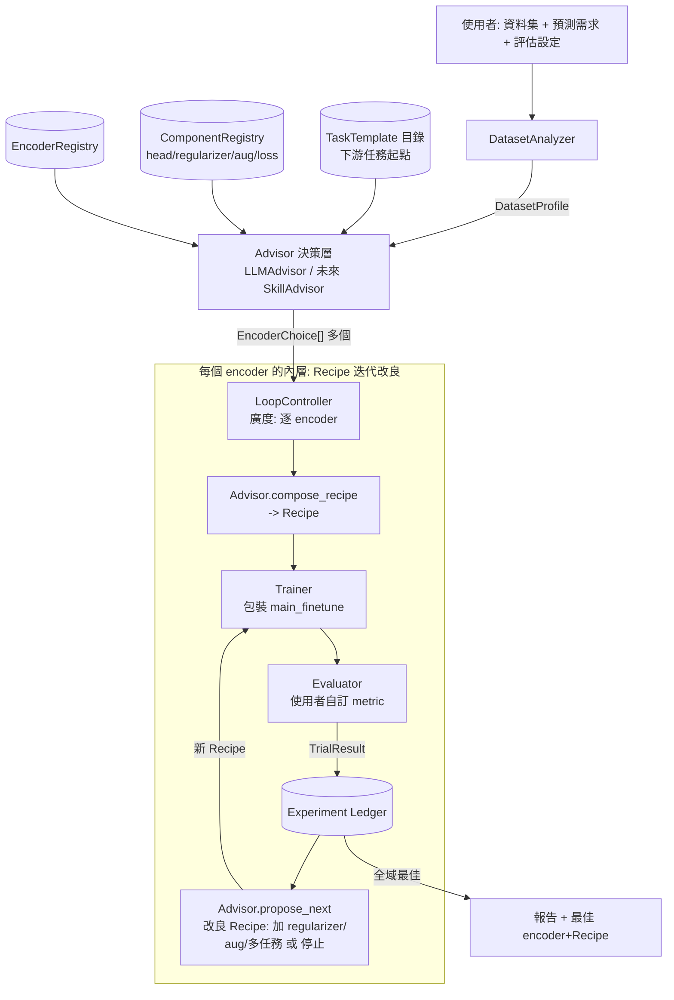

# M4 自動微調 Agent — 設計文件 (Design Document)

- 狀態：Draft v0.2
- 適用範圍：M4 (Multistage Modular Medical Models) 專案
- 目標讀者：M4 開發者
- 相關程式：`main_finetune.py`、`engine_finetune.py`、`models_vit.py`、`util/datasets.py`、`script.py`

> **v0.2 更新重點**：依需求回饋，(a) v1 即為**多 encoder** 廣度比較；(b) 「decoder」升級為**可組合、可擴充、可被修改**的 **Recipe（訓練配方）** — 不只分類頭，還能疊加 regularizer、data augmentation、多任務學習、輔助損失等改善效能的元件；(c) **任務型態可擴充**（不只分類），並預留「**下游任務起點 (TaskTemplate) 供選擇**」的機制；(d) 明確定位「現有程式只是起點」，抽象層以**開放擴充**為第一原則。

---

## 1. 目標與範圍

### 1.1 目標

打造一個「自動微調 Agent」，給定使用者提供的資料集與預測需求，能自動完成整個 adaptation 流程並回報效能。對應使用者提出的 5 個工作：

| # | 工作 | 本文件對應模組 |
| - | --- | ------------- |
| (1) | 分析資料集，自動建議**一個或多個** 預訓練模型作為 **encoder** | `DatasetAnalyzer` + `Advisor.select_encoders()` |
| (2) | 產生適合該 encoder 與資料的 **decoder / Recipe**，輸出使用者需要的預測 | `Advisor.compose_recipe()` + `RecipeBuilder` + `ComponentRegistry` |
| (3) | 選擇適當 **超參數**，訓練模型 | `Advisor`（含於 Recipe）+ `Trainer` |
| (4) | 依使用者設定的 **評估方法** 計算效能 | `Evaluator` |
| (5) | **重複 2–4**（含對 Recipe 的**改良/變異**） | `LoopController` + `Advisor.propose_next()` |

### 1.2 設計原則

- **開放擴充優先 (extensibility-first)。** 現有程式是**起點**，不是終點。encoder、decoder head、regularizer、augmentation、loss、任務型態，全部設計成**可註冊的元件**，新增能力＝新增一筆註冊，不動核心。
- **Recipe 可組合、可變異。** Advisor 不只「選一次」，而是能在迴圈中**修改 Recipe 加上新功能**（換 regularizer、加 augmentation、加輔助任務…）以試圖改善效能。
- **重用既有 pipeline。** 訓練與評估沿用已驗證的 `main_finetune.py` / `engine_finetune.py`，Agent 在其外圍做「決策 + 編排 + 記錄」。
- **決策層可抽換。** 現階段由 LLM (Claude) 直接決策；未來換成專用 skill 時，只替換 `Advisor` 一個實作。需求原文：「將來我們會提供一個 skill 來做這個選擇的工作，目前就先讓 LLM 自行決定」「將來在 skill 要根據資料來選不同的 encoder」。
- **契約優先 (contract-first)。** 模組間以明確 schema 傳遞，讓 LLM 輸出可驗證、可被非-LLM 實作取代。

### 1.3 版本範圍

- **v1 具體任務**：影像**分類**（single-label multi-class）— 現有 repo 已支援的型態，作為第一個 `TaskTemplate` 的落地。
- **v1 廣度**：**多 encoder** 平行/序列比較（非單一 encoder 深挖）。
- **v1 Recipe 可組合元件**：多種 decoder head（linear / mlp）＋可疊加的 regularizer / augmentation / loss（見 §5.4）。
- **抽象即支援、v1 未落地**：segmentation / regression / multi-label / 多任務、非 ViT backbone、下游任務起點目錄。抽象層一律預留介面（§10），逐階段補實作（§12）。

---

## 2. 名詞與抽象 (Core Abstractions)

| 抽象 | 定義 | 現有程式對應 |
| ---- | --- | ----------- |
| **Encoder** | 產生特徵的 backbone。 | `models_vit.py` 各 ViT；ViT-L `embed_dim=1024` |
| **Decoder / Head** | 把 encoder 特徵轉成該任務的輸出。可為多個（多任務）。 | timm ViT `model.head`（目前僅單層 Linear） |
| **Component** | **可註冊、可組合的訓練元件**：head、regularizer、augmentation、loss、pooling…。這是「可修改 decoder 加功能」的載體。 | 目前散落於 `main_finetune` 的 mixup/drop_path/layer_decay 等旗標 |
| **Recipe（訓練配方）** | 一次訓練的**完整可組合設定** = Encoder ⊕ Decoder head(s) ⊕ Regularizers ⊕ Augmentation ⊕ Loss ⊕ HyperParams。**Advisor 操作與變異的主要對象。** | 對應 `main_finetune` 的一整組 args，但結構化、可組合 |
| **Task** | 預測型態 + 輸出定義。v1：`classification`。 | `--nb_classes`、ImageFolder `classes` |
| **TaskTemplate（下游任務起點）** | 針對某類下游任務的**預設 Recipe 骨架 + 相容元件集**，作為 Advisor 的起點與選項。未來可「提示不同起點供選擇」。 | 現有 default/paper/mae 三組超參可視為最原始的 template 雛形 |
| **Metric / EvalConfig** | 使用者定義的評估指標與選優目標。 | `engine_finetune.evaluate()` 的 metric bundle 與 `score` |
| **Trial** | 一次「Recipe → 訓練 → 評估」完整實驗（步驟 2–4 的一輪）。 | `script.py` 的一個 `task_id` |
| **Advisor** | 決策層介面：選 encoder、組 Recipe、提超參、**改良 Recipe**、決定續跑/停止。 | 新增（v1 = LLMAdvisor） |

---

## 3. 與現有程式碼的對應

現有 `main_finetune.py` 已提供底層能力；Agent 以 **subprocess** 呼叫它（同 `script.py`）或匯入 `main()`。關鍵接點與需擴充處：

- **Encoder 載入**：`main_finetune.py:200-253` 依 `--model/--model_arch/--finetune` 建模並載權重。→ Agent 直接沿用。
- **Decoder / Recipe 注入**：目前 head 是寫死的單層 `Linear`（由 `num_classes` 決定）。→ **主要擴充點**：改為由 `Recipe` 組態化建構 head 與掛載 regularizer/loss（§5.4、§5.5）。
- **Augmentation**：`util/datasets.py:build_transform()` 目前固定用 timm `create_transform` + 一組 aug 旗標。→ 改為由 `Recipe.augmentation` 驅動。
- **Regularizer**：drop_path / weight_decay / layer_decay / label smoothing / mixup / cutmix 已散在 args。→ 收攏成 `Recipe.regularizers` 可組合清單。
- **評估與選優**：`engine_finetune.py:evaluate()` 回傳 metric bundle + `score`，best 依 val `score`（`main_finetune.py:440-476`）。→ `Evaluator` 讓選優目標可組態（§5.6）。

> 結論：Agent 是既有 pipeline 的**編排層 + 決策層 + 元件組合層**；訓練/評估核心不變，但 head 與 recipe 的組態化是必要的擴充。

---

## 4. 系統架構總覽



四份契約：`DatasetProfile` → `EncoderChoice[]` → `Recipe`（可組合/可變異）→ `TrialResult`（schema 見 §6）。

---

## 5. 模組設計

### 5.1 DatasetAnalyzer（資料集分析器）

**職責**：資料夾 → 結構化 `DatasetProfile`，作為 Advisor 決策依據。**純程式，不呼叫 LLM。**

產出 `DatasetProfile`：`num_classes / class_names / class_counts / imbalance_ratio`、`n_train/val/test`、`has_kfold`、影像統計（size 分布、灰階/彩色、長寬比）、資料量級 bucket、`modality_hint`（由路徑/檔名推得，如 fundus/gastroscopy）、品質旗標。抽樣量測以控時；重用 `util/datasets.py` loader 保持一致。

### 5.2 Advisor（決策層）— 可抽換介面

**本設計最關鍵的抽象。** 讓「LLM 決策」與「未來 skill」可互換。相較 v0.1，新增「**組合完整 Recipe**」與「**改良 Recipe**」兩個能力：

```python
class Advisor(Protocol):
    # (1) 多 encoder：依資料建議一組 encoder（未來 skill 依資料選不同 encoder）
    def select_encoders(self, profile, encoder_registry) -> list[EncoderChoice]: ...

    # (2)(3) 針對某 encoder 組出完整 Recipe（含 decoder head + regularizer + aug + loss + 超參）
    #        可從某個 TaskTemplate 起點出發
    def compose_recipe(self, profile, encoder, task_template, registry) -> Recipe: ...

    # (5) 看歷史，決定「改良 Recipe（加功能/變異）再試」或「停止」
    def propose_next(self, profile, encoder, history: list[TrialResult],
                     registry) -> NextAction: ...

    # 未來：提示不同下游任務起點供選擇
    def suggest_task_templates(self, profile, catalog) -> list[TaskTemplate]: ...
```

實作：
- **`LLMAdvisor`（v1 預設）**：呼叫 Claude API，以 **structured outputs** 強制回傳合 schema 的決策物件。
- **`SkillAdvisor`（未來）**：委派給 Claude Code skill；介面不變。這是「將來在 skill 要根據資料來選不同 encoder」的落點。
- **`HeuristicAdvisor`（測試/離線退路）**：純規則（小資料→lp+小 lr、imbalance→weighted_ce…）。

`propose_next` 的**改良動作**明確列舉（讓 LLM 從有限、可驗證的動作空間選）：`add_regularizer` / `swap_head` / `change_augmentation` / `add_auxiliary_task` / `adjust_hparams` / `stop`。每個動作對應 `ComponentRegistry` 中一個可掛載元件——這就是「修改 decoder 以加上其它功能」的機制。

#### 與 Claude API 整合（僅 Advisor 這一層依賴 LLM）

依 `claude-api` 參考：官方 `anthropic` SDK + `messages.parse()`（structured outputs）；模型 `claude-opus-4-8`；`thinking={"type":"adaptive"}`。每個決策方法綁一個 Pydantic schema，輸出即驗證。LLM 只吐「決策」，實體建構由 `RecipeBuilder`（純程式）完成，避免 LLM 直接產碼。

prompt 的分段與 prompt cache 佈局見 [prompt_structure_design.md](prompt_structure_design.md)：穩定內容（規則、registry 目錄、資料集事實、分析結果、**已完成 trials**）切成一串「寫出後就不再變動」的 content block 並加 `cache_control`，隨輪次變動的東西（本輪指令、schema、解答樹、討論）放最後。⚠ 快取比對以 **content block 邊界**為單位，不是任意位元組前綴——把會增長的內容併成單一 block 會讓快取完全失效（該文件 §3.1）。

### 5.3 EncoderRegistry

集中定義可用 encoder，作為 Advisor 選擇範圍與 Trainer 建構依據。每個 `EncoderCard`：`model_key`、對應 `--model/--model_arch`、權重來源、`embed_dim/patch_size/input_size`、預訓練領域（自然影像 / 醫療 DAP）、可取得性旗標。對應現有 `script.py:get_model_info()` 規則。新增 encoder＝新增一筆 card。

### 5.4 ComponentRegistry + RecipeBuilder（可組合、可擴充、可修改的核心）

**這是回應「decoder 不只分類、要能修改加功能」的核心設計。** 把訓練配方拆成**可註冊、可組合的元件**，Advisor 組合/變異它們，`RecipeBuilder`（純程式）負責把 `Recipe` 實體化。

**元件類別（皆為 registry，可擴充）**：

| 類別 | v1 內建 | 擴充範例 |
| ---- | ------- | -------- |
| **Head（decoder）** | `linear`、`mlp` | `segmentation`、`regression`、`multi_head`（多任務） |
| **Pooling** | `global_pool`、`cls_token` | `attention_pool` |
| **Regularizer** | `drop_path`、`weight_decay`、`layer_decay`、`label_smoothing`、`mixup`、`cutmix` | `stochastic_depth`、`ema`、`r-drop`、`spectral_norm` |
| **Augmentation** | timm RandAug（現況）、`resize/crop/normalize` | `RandAugment 強度掃描`、醫療影像專用 aug、`test-time aug` |
| **Loss** | `cross_entropy`、`weighted_ce`、`focal` | `dice/ce`(seg)、`mse`(reg)、`多任務加權和`、`對比輔助損失` |
| **Auxiliary task（多任務）** | —（v1 預留） | rotation/jigsaw 自監督輔助頭、額外標註頭 |

**Recipe 結構**（可組合宣告，非寫死）：

```python
class Recipe(BaseModel):
    encoder: EncoderChoice
    task: TaskSpec                          # 型態 + 輸出定義
    heads: list[HeadSpec]                   # 多任務 => 多個 head
    pooling: str
    regularizers: list[ComponentRef]        # 可疊加，Advisor 動態增減
    augmentation: AugmentationSpec
    losses: list[LossRef]                    # 多任務 => 多個 + 權重
    hparams: HyperParams
    provenance: dict                         # 來自哪個 TaskTemplate / 上一個 trial 變異了什麼
```

**RecipeBuilder** 把 `Recipe` 轉成 Trainer 可執行的東西：
- 掛 head（覆寫/擴充 `main_finetune` 建模後的 `model.head`；多 head 則各自輸出）。
- 把 regularizer/aug/loss 轉成 `main_finetune` 的參數或注入點（v1 多數已有對應旗標；新元件則加對應 CLI 或 in-process hook）。
- **驗證相容性**：Head 型態 × Task × Loss × Metric 必須相容（如 seg head 不能配 argmax 分類 metric），不合即由 builder 擋下並回饋 Advisor。

> **可修改性**：Advisor 在 `propose_next` 產出的不是「全新 Recipe」，而是對現有 Recipe 的**變異 (mutation)** —「在這個表現不錯的 recipe 上加 focal loss + 更強 augmentation」。Ledger 的 `provenance` 記錄變異譜系，便於分析什麼改動有效。

### 5.5 Trainer（訓練器）

**職責**：`Recipe + 資料路徑` → 執行一次訓練 → 回傳 checkpoint + log。

- **實作**：建議 subprocess（同 `script.py`，隔離性佳、易平行）；`Recipe` 透過（既有 + 新增的）CLI 參數傳入 `main_finetune.py`；複雜元件用 in-process hook。
- **多 encoder 平行**：沿用 `script.py` 的 GPU 排程，但 **修正已知問題**——現以 `memoryUtil<0.1` 判斷空閒，在 `Exclusive_Process` 模式（本環境、外部租戶共用實體 GPU）會誤判被佔用的卡為可用；應改以「實際嘗試配置 CUDA」判斷。

### 5.6 Evaluator（評估器）— 使用者自訂評估方法

- 重用 `engine_finetune.evaluate()` 的 metric bundle；讓選優目標與報告指標由 `EvalConfig` 決定（`primary_metric`、`report_metrics`、`selection`、多 fold `aggregation=mean_std`）。
- 支援註冊自訂 `callable(y_true, y_prob) -> float`。
- **隨任務型態切換**：不同 `Task` 對應不同預設 metric 集（分類 acc/f1/auroc；reg → MAE/R²；seg → mIoU/Dice）。目前 `evaluate()` 的 `score=(f1+auroc+kappa)/3` 寫死，需重構為讀 `EvalConfig`（保留現有預設值一致）。

### 5.7 LoopController（迴圈控制）— 步驟 5，兩層迴圈

**外層（廣度，v1 重點）**：對 Advisor 建議的**多個 encoder** 逐一（或平行）比較。
**內層（深度，改良）**：對每個 encoder，`compose_recipe → 訓練 → 評估 → propose_next（改良 Recipe）` 迭代若干輪，試圖用元件變異改善效能。

- 維護 `best_trial`（依 `EvalConfig.primary_metric`），跨 encoder 全域比較，產最終報告。
- **停止條件 `StopPolicy`（聯集）**：`max_trials`（硬上限，必要）、每 encoder `patience` 無提升、時間/計算預算、Advisor 判定收斂。
- **預算配置**：外層「每 encoder 的 trial 配額」× encoder 數 需明確上限，避免組合爆炸（尤其 ×5 fold）。
- **搜尋策略**：v1 為 LLM-in-the-loop 引導式變異，冷啟動用 TaskTemplate 內建 preset；介面允許未來換 Bayesian/Hyperband。

### 5.8 TaskTemplate 目錄（下游任務起點）

回應「將來甚至可能提示不同的下游任務起點供選擇」。每個 `TaskTemplate` = 針對某類下游情境的**預設 Recipe 骨架 + 相容元件白名單 + 預設 EvalConfig**。
- v1：`fundus_classification`（落地現有分類流程，含 default/paper/mae 三組超參起點）。
- 未來：`segmentation`、`regression`、`multitask_*`… 由 `Advisor.suggest_task_templates()` 依 `DatasetProfile` 提示候選，供使用者或 Agent 挑起點再變異。

### 5.9 Experiment Ledger（實驗記錄）

每個 trial 一筆 `TrialResult`（JSON），含完整 `Recipe`、metrics、checkpoint/log 路徑、`provenance`（變異譜系）。沿用現有輸出慣例。提供 `history()` 給 `propose_next`、`best()` 給報告。

---

## 6. 資料契約 (Schemas)

Pydantic 定義，兼作 LLM structured-output schema 與模組型別。摘要：

```python
class DatasetProfile(BaseModel):
    root: str; task_type: str
    num_classes: int; class_names: list[str]; class_counts: dict[str, int]
    n_train: int; n_val: int; n_test: int; has_kfold: bool
    image_size_stats: dict; is_grayscale: bool; imbalance_ratio: float
    modality_hint: str | None

class EncoderChoice(BaseModel):
    model_key: str
    adaptation: Literal["finetune", "lp"]
    rationale: str

class ComponentRef(BaseModel):           # 可組合元件的引用 + 參數
    name: str                            # registry key, e.g. "focal", "mixup"
    params: dict = {}

class HeadSpec(BaseModel):
    type: Literal["linear", "mlp"]       # v1；未來 segmentation/regression/...
    output_dim: int
    hidden_dims: list[int] = []
    dropout: float = 0.0
    target: str = "main"                 # 多任務時對應哪個標的

class Recipe(BaseModel):
    encoder: EncoderChoice
    task: dict                           # TaskSpec：type + 輸出定義
    heads: list[HeadSpec]                # 多任務 => 多個
    pooling: Literal["global_pool", "cls_token"]
    regularizers: list[ComponentRef]     # 可疊加，動態增減
    augmentation: ComponentRef
    losses: list[ComponentRef]           # 多任務 => 多個 + 權重(params)
    hparams: "HyperParams"
    provenance: dict = {}                # 起點 template / 上一 trial 變異內容

class HyperParams(BaseModel):
    batch_size: int; epochs: int
    blr: float; layer_decay: float; drop_path: float
    weight_decay: float = 0.05; warmup_epochs: int = 10
    input_size: int = 224; accum_iter: int = 1

class NextAction(BaseModel):
    stop: bool
    reason: str
    mutation: Literal["add_regularizer","swap_head","change_augmentation",
                      "add_auxiliary_task","adjust_hparams","none"] = "none"
    next_recipe: Recipe | None = None    # 變異後的完整 recipe

class TrialResult(BaseModel):
    trial_id: str; recipe: Recipe
    metrics: dict[str, float]; primary_score: float
    ckpt_path: str; log_path: str
```

---

## 7. 設定檔與 CLI

```yaml
data_path: ./data/5_fold_PAPILA/PAPILA_seed42_fold0
task: { type: classification }
task_template: fundus_classification          # 下游任務起點
eval:
  primary_metric: auroc
  report_metrics: [accuracy, f1, auroc, kappa]
  aggregation: mean_std
loop:
  encoders_per_run: 3          # 多 encoder 廣度
  trials_per_encoder: 4        # 每 encoder 的 Recipe 改良輪數
  max_trials: 12               # 全域硬上限
  patience: 2
advisor: { type: llm, model: claude-opus-4-8 }   # llm | skill | heuristic
budget: { max_wall_clock_min: null }
```

CLI：`python auto_finetune.py --config config.yaml`。

---

## 8. 預算與資源控制

- **計算為主要成本**：`max_trials`、`trials_per_encoder × encoders`、`max_wall_clock` 為主要護欄。單張 A30、ViT-L、50 epochs、~500 張 ≈ 十餘分鐘/trial，多 encoder × 多 recipe 需明確上限。
- **LLM 成本小**（Advisor 每 trial 數次呼叫），仍記錄 token。
- **GPU 可用性**：見 §5.5 的 Exclusive_Process 修正。

---

## 9. 輸出目錄結構

```
runs/<experiment_name>/
├── config.yaml                  # 設定快照
├── dataset_profile.json
├── ledger.jsonl                 # 每行一個 TrialResult（含 recipe + provenance）
├── trials/<trial_id>/           # = main_finetune output_dir/<task_id>
│   ├── checkpoint-best.pth
│   ├── metrics_val.csv / metrics_test.csv
│   └── confusion_matrix_test.jpg
└── report.md                    # 各 encoder 最佳 recipe 比較 + 全域最佳
```

---

## 10. 擴充性 (第一原則，非「未來再說」)

抽象層一律為以下開放；v1 提供介面 + 分類的具體實作：
- **新 encoder**：加一筆 `EncoderCard`（+ 必要的 `models_vit` builder）。
- **新 decoder head / 任務**：`ComponentRegistry` 註冊 `HeadSpec.type`（segmentation/regression/multi_head）＋對應 loss/metric；`Task` 與 `EvalConfig` 隨之切換。
- **新增改善效能的功能**：註冊新 `Regularizer / Augmentation / Loss / AuxiliaryTask` 元件，Advisor 的 `propose_next` 即可把它當變異動作使用——**這正是「修改 decoder 加功能」的擴充路徑**。
- **多任務學習**：`Recipe.heads`/`losses` 支援多個 + 權重；`RecipeBuilder` 組多頭模型與加權損失。
- **下游任務起點**：新增 `TaskTemplate`，`Advisor.suggest_task_templates()` 依資料提示候選供選擇。
- **非 ViT backbone**：Encoder Registry + builder；Advisor 介面不變。

---

## 11. 風險與待決問題 (Open Questions)

1. **head/recipe 注入需改 `main_finetune`**：加 head 組態與元件掛載參數，屬最小侵入式修改，需確認不破壞現有 baseline 重現。
2. **`score` 寫死**：`evaluate()` 選優 `score` 需組態化，保留現有預設值一致。
3. **GPU 排程誤判**：`memoryUtil<0.1` 在 Exclusive_Process 會誤判（本環境即是），改用實際 CUDA 配置測試。
4. **LLM 決策可驗證性**：可能給出不存在的元件/不相容組合/越界超參 → schema 驗證 + Registry 白名單 + 相容性檢查 + 範圍 clamp 為必要防線。
5. **組合爆炸**：多 encoder × 多 recipe 變異 × 多 fold 成本高，需明確配額與（可選）先在單 fold 篩選再擴 fold。
6. **變異動作空間的設計**：`propose_next` 的可用 mutation 需精心設計成「有限、正交、可驗證」，避免 LLM 亂變導致不可控搜尋。

---

## 12. 分階段實作路線圖

| 階段 | 內容 | 交付 |
| ---- | --- | ---- |
| **P0 骨架** | 契約 schema + `DatasetAnalyzer` + `EncoderRegistry` + `HeuristicAdvisor` + Trainer(subprocess) 串單一 trial | 對 PAPILA 跑通一輪並落地 `TrialResult` |
| **P1 多 encoder** | `LoopController` 外層：多 encoder 廣度比較 + 全域最佳 | 一次跑多個 encoder 並比較 |
| **P2 LLM 決策** | `LLMAdvisor`（structured outputs）接 `select_encoders / compose_recipe` | LLM 依資料選多 encoder 並組 Recipe |
| **P3 Recipe 元件化** | `ComponentRegistry` + `RecipeBuilder`；head(mlp)、regularizer、aug、loss 可組合；`main_finetune` head/元件組態化 | 可產非單層 head、可疊加元件 |
| **P4 改良迴圈** | `propose_next` 的 mutation 動作 + provenance + `StopPolicy` | 步驟 5：Recipe 迭代改良（加功能）自動化 |
| **P5 評估自訂** | `EvalConfig` + 自訂 metric + 多 fold 彙整 | 使用者定義評估方法與選優目標 |
| **P6 任務擴充** | `TaskTemplate` 目錄 + 至少一個非分類任務（reg 或 seg）走通抽象 | 驗證「不只分類」可擴充 |
| **P7 skill 接口** | `SkillAdvisor` 替換 `LLMAdvisor` | 決策層可抽換，未來由 skill 依資料選 encoder |

---

## 附錄 A：需求追溯 (Traceability)

- **多 encoder** → §5.2 `select_encoders` + §5.7 LoopController 外層（P1）
- **未來 skill 依資料選 encoder** → §5.2 `SkillAdvisor`（P7）
- **decoder 不只分類、可擴充其它任務** → §5.4 Head registry + §5.8 TaskTemplate + §10（P6）
- **修改 decoder 加功能（regularizer / augmentation / 多任務…）** → §5.4 ComponentRegistry + §5.2 `propose_next` mutation（P3/P4）
- **現有程式是起點** → §1.2 開放擴充第一原則；§12 逐階段補實作
- **提示不同下游任務起點供選擇** → §5.8 TaskTemplate + `Advisor.suggest_task_templates`
